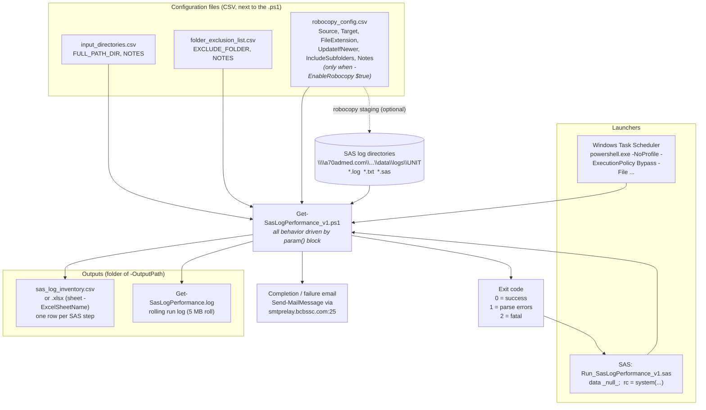
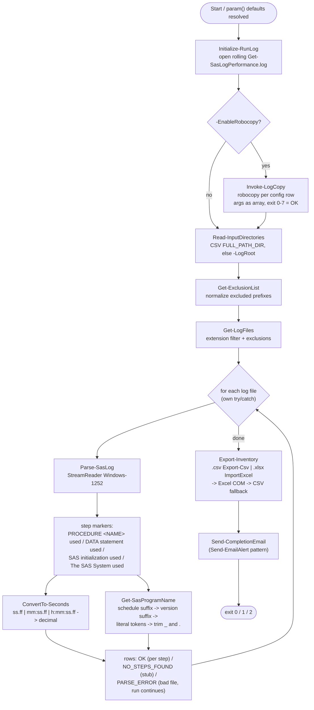

# SAS Log Performance Crawler — Architecture

How `Get-SasLogPerformance_v1.ps1`, its configuration CSVs, the SAS launcher,
and the outputs fit together.

## Deployment layout

```text
\\a70admed.com\R1\CGS\APPS\SAS\UNIT\SAS_G\SAS\Manuel\code\ps\sas_crawler\
├── Get-SasLogPerformance_v1.ps1     the crawler (all logic, param() at top)
├── input_directories.csv            root folders to crawl   (FULL_PATH_DIR,NOTES)
├── folder_exclusion_list.csv        folders to skip         (EXCLUDE_FOLDER,NOTES)
└── robocopy_config.csv              optional staging jobs   (Source,Target,FileExtension,
                                     UpdateIfNewer,IncludeSubfolders,Notes)
                                     used only with -EnableRobocopy $true

Run_SasLogPerformance_v1.sas         SAS wrapper (can live anywhere SAS can read)
```

The three CSVs are found *next to the .ps1* by default; each location can be
overridden with `-InputDirectoriesCsv`, `-FolderExclusionCsv`,
`-RobocopyConfigCsv`. If `input_directories.csv` is missing, the crawler falls
back to the single `-LogRoot` path
(default `\\a70admed.com\R1\CGS\APPS\SAS\UNIT\SAS_G\SAS\Manuel\data\logs\UNIT`).

## System diagram



## Internal pipeline (functions inside the .ps1)



## File reference

| File | Role | Consumed by | Required |
|---|---|---|---|
| `Get-SasLogPerformance_v1.ps1` | Crawler/parser/exporter | Task Scheduler or SAS wrapper | yes |
| `Run_SasLogPerformance_v1.sas` | SAS launcher; maps exit code to NOTE/WARNING/ERROR, optional `abort return 2` | SAS batch / EG | optional |
| `input_directories.csv` | Root directories to crawl (`FULL_PATH_DIR`) | `Read-InputDirectories` | no — falls back to `-LogRoot` |
| `folder_exclusion_list.csv` | Folder prefixes to skip (`EXCLUDE_FOLDER`) | `Get-ExclusionList` | no |
| `robocopy_config.csv` | Staging copy jobs | `Invoke-LogCopy` | only with `-EnableRobocopy $true` |
| `sas_log_inventory.csv` / `.xlsx` | Output inventory (one row per SAS step) | reporting / Excel | produced |
| `Get-SasLogPerformance.log` | Rolling run log next to the output | troubleshooting | produced |
| `sample_logs/` | Synthetic SAS 9.4 fixtures for validation | testing only | no |
